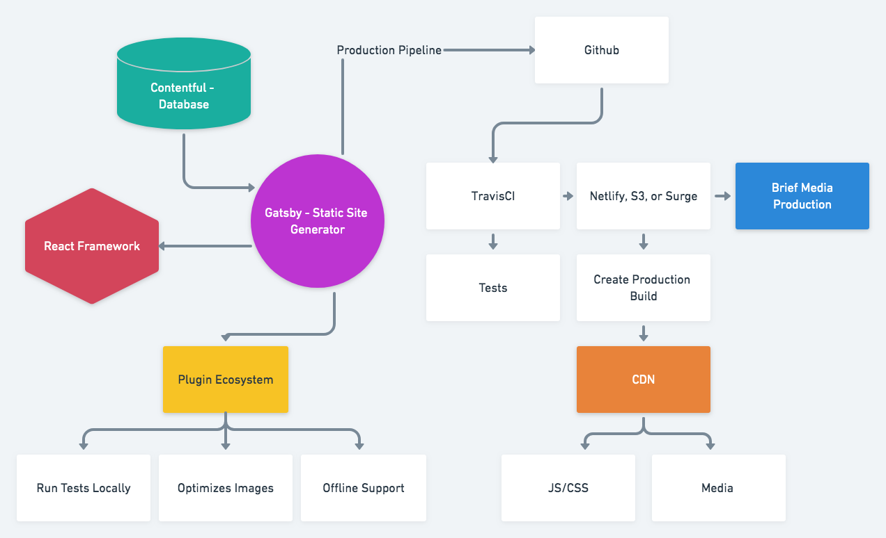

# Brief Engineering Team
### TOPIC
## How to create a sustainable website in 2019?
#### Presented by: Richard Keller

???
- Building a new website
- Sustainable
- Includes developer happiness
---

### Core Architecture Goals

One of the main goals of a technology team is to be more productive. 

The more productive we are, the more time we have to make the business stronger by building great products and services.

### Our websites should be:

#### 1. Easy to host
#### 2. Easy for developers to work on
#### 3. Easy to deploy to production
#### 4. Scalable over the long term

???
- Why is this better?
- We don't want to manage servers, we want to create products.

---

# The Design

---

# Contentful

Database as a service with API for Developers
### GraphQL out of the box
### Simple API
### Hosted Database

---

# React 
React is currently the most popular framework used in web development.

#### Open source MIT
#### Used by over 2 million projects on Github
#### 131K Stars
#### Great documentation
#### Used by Microsoft, Facebook, and name any other company

---

# Gatsby

Static site generator built with React

#### Open source MIT
#### 79K Projects on Github
#### 35K Stars
#### Vibrant plugin ecosystem
#### Great documentation
#### On their 6K+ Release
#### Bonus Integrates with Contentful

???
notes...

---

# Netlify

#### CI Pipeline for Code builds
#### Custom Authentication solutions available
#### CDN Support
#### CLI tools → Deploy a site with one command

???

- start demo deploy

---
# Demo

???
CSS Argument - Open blog post
